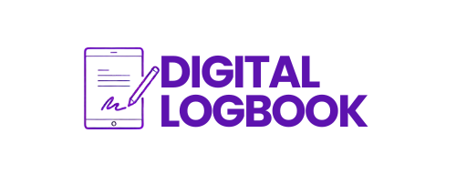

<div align="center">



## :notebook: DIGITAL LOGBOOK :notebook:
<h3><em>Empowering Growth Through Transparency and Collaboration</em></h3>

</div>

## :memo: Overview
The **T2T Digital Logbook** is a comprehensive system designed for students and mentors participating in the T2T program. It facilitates This tool facilitates the tracking of daily activities, progress monitoring, and feedback provision. The system was developed to ensure transparency, organization, and efficiency in the mentoring process, helping students grow and succeed.

## :book: Table of Contents
- [:memo: Overview](#memo-overview)
- [:mag\_right: Features](#mag_right-features)
  - [Functional Features](#functional-features)
    - [:man\_student:Student Features](#man_studentstudent-features)
    - [:man\_teacher:Mentor Features](#man_teachermentor-features)
  - [Non-Functional Features](#non-functional-features)
- [:gear: Technical Requirements](#gear-technical-requirements)
- [:hammer\_and\_wrench: Installation and Setup Instructions](#hammer_and_wrench-installation-and-setup-instructions)
- [:rocket: Usage](#rocket-usage)
- [:handshake: Contributing Guidelines](#handshake-contributing-guidelines)
- [:page\_facing\_up: License](#page_facing_up-license)

## :mag_right: Features
### Functional Features

The **T2T Digital Logbook** provides several key functional features designed to facilitate effective communication, activity tracking, and feedback between students and mentors in the T2T program. Features are designed to enhance the overall learning experience, ensure transparency, and maintain an organized mentoring process

#### :man_student:Student Features

- **Secure Login**: Students can securely log in to the system using their credentials.
- **Daily Activity Logging**: Students can select a date and log their daily activities, time spent on each activity, and any relevant notes.
- **View Historical Entries**: Students can view their past activity entries for reference and self-assessment.
- **Activity Entry Time Limit**: Students cannot enter or edit an activity after 2 days from the activity date, ensuring timely logging.

#### :man_teacher:Mentor Features

- **Secure Login**: Mentors can securely log in to the system using their credentials.
- **Daily Activity Logging**: Mentors can log their daily mentoring activities, including the time spent mentoring each student, the nature of the activities, and any additional notes.
- **Register and Manage Students**: Mentors can register new students into the system, assign them to their mentorship, and manage their profiles.
- **View Student History**: Mentors can view the historical activities logged by their assigned students to monitor their progress.
- **Approve/Reject Activities**: Mentors can approve or reject each activity entry to ensure it meets the program’s standards.
- **Add Feedback Notes**: Mentors can add specific feedback notes to a student's activity entries, helping guide the student’s development.
- **Overall Feedback**: Mentors can provide overall feedback on a student's performance throughout the program.
- **Export Reports**: Mentors can export detailed reports on the progress and activities of each student individually or in bulk for all students they mentor.


### Non-Functional Features

:lock: **Security**:  
   - The system ensures data security by allowing access only to authorized users.
   - Sensitive information such as passwords is encrypted using robust hashing algorithms.

:bulb: **Usability**:  
   - The application is designed with a user-friendly interface that is easy to navigate for students and mentors.
   - Clear prompts and validation messages to guide users in logging activities and providing feedback.

:rocket: **Performance**:  
   - The system is optimized to handle multiple users simultaneously without significant delays.
   - Fast response times for data retrieval and updates to ensure a smooth user experience.

:globe_with_meridians: **Availability**:  
   - The system is designed to be available 24/7 with minimal downtime.
   - High availability is maintained through redundancy and regular backups.

:chart_with_upwards_trend: **Scalability**:  
   - The application can scale to accommodate a growing number of users and increased data volumes as the T2T program expands.

:wrench: **Maintainability**:  
   - The codebase is modular and follows best practices to ensure easy maintenance and updates.
   - Well-documented code and a consistent coding style for easier collaboration among developers.

:white_check_mark: **Compliance**:  
   - The system adheres to data protection regulations to ensure the privacy and security of student and mentor data.


## :gear: Technical Requirements

- **Node.js**: v22.7.0
- **Node Package Manager (npm)**: 10.8.2
- **PostgreSQL**: v16.3
- **pgAdmin**
- **TypeScript**: v5.5.4
- **Prisma**: v5.18.0
- **Next.js**: 14.2.5
- **Tailwind CSS**: v3.4.1
- **ESLint**: v8  
- **Docker**: 27.1.2
- **Jest**: v29.7.0 
- **React**: v18  


## :hammer_and_wrench: Installation and Setup Instructions

Follow these steps to install and set up the T2T Digital Logbook on your local machine:

1. **Clone the repository**:
    ```bash
    git clone https://github.com/tracet2t/Digital-Logbook.git
    cd Digital-Logbook
    ```

2. **Install dependencies**:
    ```bash
    npm install
    ```

3. **Set up the database**:
    - Ensure Docker is running.
    - Start PostgreSQL using Docker:
      ```bash
      docker-compose up -d
      ```
    - Apply database migrations:
      ```bash
      npx prisma migrate dev
      ```

4. **Run the seed script** to populate the database with initial data:
    ```bash
    npm run seed
    ```

5. **Start the development server**:
    ```bash
    npm run dev
    ```

6. **Access the application**:
    - Open your browser and go to `http://localhost:3000` to interact with the app.


## :rocket: Usage
The T2T Digital Logbook is a web application designed for students and mentors. Here’s how to use it:

### Students:
- **Login**: Enter your credentials on the login page to access the system.
- **Log Activities**: Select a date and enter your daily activities, time spent, and additional notes.
- **View History**: Review past activities through the history section.

### Mentors:
- **Login**: Enter your credentials to access mentor-specific features.
- **Manage Students**: Register new students and manage existing student profiles.
- **Review Activities**: Approve or reject student activities, and provide feedback.
- **Export Reports**: Generate and download activity reports for individual students or all mentees.


## :handshake: Contributing Guidelines
We welcome contributions from developers! Here’s how you can contribute:

1. **Fork the Repository**: Click the "Fork" button on GitHub to create a copy of the repository under your account.
2. **Clone Your Fork**: Clone the forked repository to your local machine:
    ```bash
    git clone https://github.com/tracet2t/Digital-Logbook.git
    cd Digital-Logbook
    ```
3. **Create a New Branch**: Always work on a new branch:
    ```bash
    git checkout -b feature/your-feature-name
    ```
4. **Make Your Changes**: Implement your changes, following the project’s coding standards.
5. **Commit Your Changes**: Write a clear and descriptive commit message:
    ```bash
    git commit -m "Add feature X"
    ```
6. **Push to Your Branch**: Push the branch to your GitHub repository:
    ```bash
    git push origin feature/your-feature-name
    ```
7. **Create a Pull Request**: On GitHub, open a pull request against the main branch of the original repository.

## :page_facing_up: License

This project is licensed under the **MIT License**. This means you are free to use, modify, and distribute this software, provided that you include the original copyright notice and license in any copies or substantial portions of the software.

For more details, see the [LICENSE](LICENSE) file.