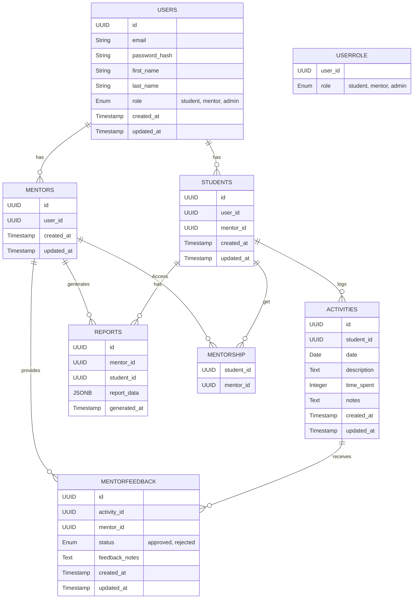

### Databse Schema

1. **Users**
- `id` (UUID, Primary Key): Unique identifier for each user.
- `email` (String, Unique, Not Null): Email address used for login.
- `password_hash` (String, Not Null): Hashed password for security.
- `first_name` (String, Not Null): User’s first name.
- `last_name` (String, Not Null): User’s last name.
- `role` (Enum: 'student', 'mentor', 'admin', Not Null): Role of the user in the system.
- `created_at` (Timestamp, Not Null, Default: Current Timestamp): The timestamp when the user was created.
- `updated_at` (Timestamp, Not Null, Default: Current Timestamp): The timestamp when the user was last updated.

2. **Students**
- `id` (UUID, Primary Key): Unique identifier for each student.
- `user_id` (UUID, Foreign Key -> Users.id, Not Null): References the user table for student details.
- `mentor_id` (UUID, Foreign Key -> Users.id, Nullable): References the mentor assigned to the student.
- `created_at` (Timestamp, Not Null, Default: Current Timestamp): The timestamp when the student was created.
- `updated_at` (Timestamp, Not Null, Default: Current Timestamp): The timestamp when the student was last updated.

3. **Mentors**
- `id` (UUID, Primary Key): Unique identifier for each mentor.
- `user_id` (UUID, Foreign Key -> Users.id, Not Null): References the user table for mentor details.
- `created_at` (Timestamp, Not Null, Default: Current Timestamp): The timestamp when the mentor was created.
- `updated_at` (Timestamp, Not Null, Default: Current Timestamp): The timestamp when the mentor was last updated.

4. **Activities**
- `id` (UUID, Primary Key): Unique identifier for each activity.
- `student_id` (UUID, Foreign Key -> Students.id, Not Null): References the student who logged the activity.
- `date` (Date, Not Null): The date of the activity.
- `description` (Text, Not Null): Description of the activity.
- `time_spent` (Integer, Not Null): Time spent on the activity (in minutes).
- `notes` (Text, Nullable): Additional notes added by the student.
- `created_at` (Timestamp, Not Null, Default: Current Timestamp): The timestamp when the activity was logged.
- `updated_at` (Timestamp, Not Null, Default: Current Timestamp): The timestamp when the activity was last updated.

5. **MentorFeedback**
- `id` (UUID, Primary Key): Unique identifier for each feedback entry.
- `activity_id` (UUID, Foreign Key -> Activities.id, Not Null): References the activity being reviewed.
- `mentor_id` (UUID, Foreign Key -> Mentors.id, Not Null): References the mentor providing the feedback.
- `status` (Enum: 'approved', 'rejected', Not Null): Status of the activity after mentor review.
- `feedback_notes` (Text, Nullable): Feedback notes provided by the mentor.
- `created_at` (Timestamp, Not Null, Default: Current Timestamp): The timestamp when the feedback was given.
- `updated_at` (Timestamp, Not Null, Default: Current Timestamp): The timestamp when the feedback was last updated.

6. **Reports**
- `id` (UUID, Primary Key): Unique identifier for each report.
- `mentor_id` (UUID, Foreign Key -> Mentors.id, Not Null): References the mentor who generated the report.
- `student_id` (UUID, Foreign Key -> Students.id, Nullable): References the student for whom the report was generated (nullable if report is for all students)
- `report_data` (JSONB, Not Null): The report data, stored as JSON.
- `generated_at` (Timestamp, Not Null, Default: Current Timestamp): The timestamp when the report was generated.

7. **UserRole**
- `user_id` (UUID, Foreign Key -> Users.id, Primary Key, Not Null): References the user.
- `role` (Enum: 'student', 'mentor', 'admin', Not Null): Role assigned to the user.

8. **Mentorship**
- `mentor_id` (UUID, Foregin Key -> Mentors.id, Primary Key, Not Null): References the mentor.)
- `student_id` (UUID, Foregin Key -> Students.id, Primary Key, Not Null): References the student.)

**Mermaid ER diagram**

