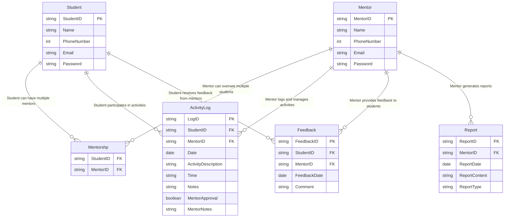

```mermaid
erDiagram
    Student {
        string StudentID PK
        string Name
        int PhoneNumber
        string Email
        string Password
    }
    Mentor {
        string MentorID PK
        string Name
        int PhoneNumber
        string Email
        string Password
    }
    ActivityLog {
        string LogID PK
        string StudentID FK
        string MentorID FK
        date Date
        string ActivityDescription
        string Time
        string Notes
        boolean MentorApproval
        string MentorNotes
    }
    Feedback {
        string FeedbackID PK
        string StudentID FK
        string MentorID FK
        date FeedbackDate
        string Comment
    }
    Report {
        string ReportID PK
        string MentorID FK
        date ReportDate
        string ReportContent
        string ReportType 
    }
    Mentorshp {
        string StudentID FK
        string MentorID FK
    }

    Student ||--o{ Mentorshp : "Student can have multiple mentors"
    Mentor ||--o{ Mentorshp : "Mentor can oversee multiple students"
    Mentor ||--o{ ActivityLog : "Mentor logs and manages activities"
    Student ||--o{ ActivityLog : "Student participates in activities"
    Mentor ||--o{ Feedback : "Mentor provides feedback to students"
    Student ||--o{ Feedback : "Student receives feedback from mentors"
    Mentor ||--o{ Report : "Mentor generates reports"

```