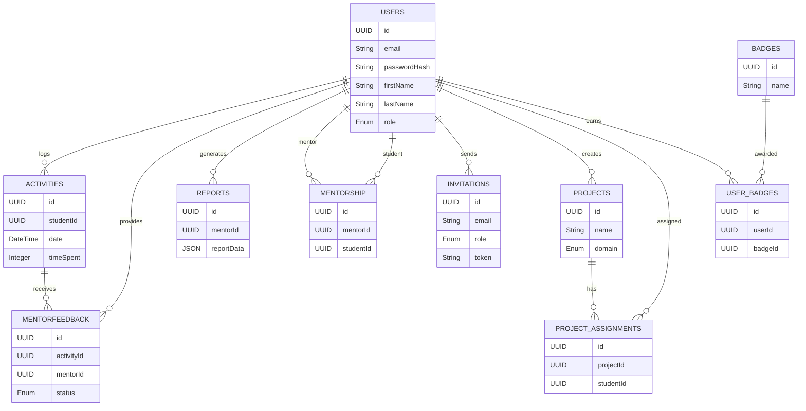

## Database Schema

### 1. Users

- `id` (UUID, Primary Key): Unique identifier for each user.
- `email` (String, Unique, Not Null): Email address used for login.
- `passwordHash` (String, Nullable): Hashed password for authentication.
- `firstName` (String, Not Null): User’s first name.
- `lastName` (String, Not Null): User’s last name.
- `emailConfirmed` (Boolean, Default: false): Indicates whether the email is verified.
- `role` (Enum: `student`, `mentor`, `super_admin`): Role of the user in the system.
- `isActive` (Boolean, Default: true): Indicates whether the account is active.
- `isFirstTimeLogin` (Boolean, Default: true): Tracks first login status.
- `invitedBy` (String, Nullable): ID of the user who invited this user.
- `createdAt` (Timestamp, Default: Current Timestamp): When the user was created.
- `updatedAt` (Timestamp, Auto Updated): When the user was last updated.

---

### 2. Activities

- `id` (UUID, Primary Key): Unique identifier for each activity.
- `studentId` (UUID, Foreign Key → Users.id): References the student who logged the activity.
- `date` (DateTime, Not Null): Date when the activity occurred.
- `timeSpent` (Integer, Not Null): Time spent on the activity (minutes).
- `notes` (String, Nullable): Additional notes for the activity.
- `createdAt` (Timestamp, Default: Current Timestamp): Activity creation time.
- `updatedAt` (Timestamp, Auto Updated): Activity last updated time.

---

### 3. Mentor Feedback

- `id` (UUID, Primary Key): Unique identifier for each feedback entry.
- `activityId` (UUID, Foreign Key → Activities.id): Activity being reviewed.
- `mentorId` (UUID, Foreign Key → Users.id): Mentor providing feedback.
- `status` (Enum: `approved`, `rejected`, `pending`): Activity review status.
- `feedbackNotes` (Text, Nullable): Mentor comments.
- `createdAt` (Timestamp): Feedback creation time.
- `updatedAt` (Timestamp): Feedback last update time.

---

### 4. Reports

- `id` (UUID, Primary Key): Unique identifier for each report.
- `mentorId` (UUID, Foreign Key → Users.id): Mentor who generated the report.
- `reportData` (JSON): Report content stored as JSON.
- `status` (Enum: `pending`, `error`, `completed`, `wip`): Report generation status.
- `generatedAt` (Timestamp): When the report was generated.

---

### 5. Mentorship

- `id` (UUID, Primary Key): Unique identifier for the mentorship relationship.
- `mentorId` (UUID, Foreign Key → Users.id): Assigned mentor.
- `studentId` (UUID, Foreign Key → Users.id): Assigned student.

---

### 6. Mentor Activities

- `id` (CUID, Primary Key): Unique identifier for mentor activity.
- `mentorId` (UUID, Foreign Key → Users.id): Mentor performing the activity.
- `date` (DateTime): Activity date.
- `workingHours` (Integer): Number of hours worked.
- `activities` (String): Description of mentor work.
- `createdAt` (Timestamp): Creation time.
- `updatedAt` (Timestamp): Last updated time.

---

### 7. Invitations

- `id` (UUID, Primary Key): Unique invitation identifier.
- `email` (String): Email address of invited user.
- `role` (Enum: `student`, `mentor`, `super_admin`): Role assigned.
- `token` (String, Unique): Unique invitation token.
- `invitedBy` (UUID, Foreign Key → Users.id): User who sent the invitation.
- `expiresAt` (DateTime): Expiration date of invitation.
- `accepted` (Boolean, Default: false): Whether the invitation was accepted.
- `createdAt` (Timestamp): Invitation creation time.

---

### 8. Projects

- `id` (UUID, Primary Key): Unique identifier for each project.
- `name` (String): Project name.
- `description` (String, Nullable): Project description.
- `domain` (Enum: `software`, `film`, `training`, `research`, `other`): Project category.
- `createdBy` (UUID, Foreign Key → Users.id): User who created the project.
- `createdAt` (Timestamp): Creation time.
- `updatedAt` (Timestamp): Last update time.

---

### 9. Project Assignments

- `id` (UUID, Primary Key): Unique identifier for assignment.
- `projectId` (UUID, Foreign Key → Projects.id): Assigned project.
- `studentId` (UUID, Foreign Key → Users.id): Assigned student.
- `assignedAt` (Timestamp): Assignment time.

---

### 10. Badges

- `id` (UUID, Primary Key): Unique badge identifier.
- `name` (String): Badge name.
- `description` (String, Nullable): Badge description.
- `iconUrl` (String, Nullable): Badge icon URL.
- `createdAt` (Timestamp): Badge creation time.

---

### 11. User Badges

- `id` (UUID, Primary Key): Unique identifier for user badge.
- `userId` (UUID, Foreign Key → Users.id): User who received the badge.
- `badgeId` (UUID, Foreign Key → Badges.id): Badge awarded.
- `awardedAt` (Timestamp): Time when the badge was awarded.

---

## Mermaid ER Diagram

