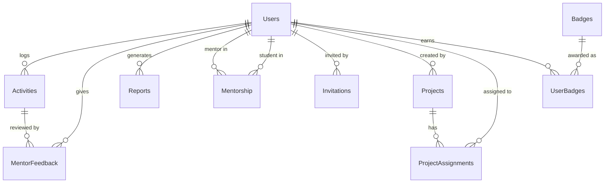

# Database Schema

This page describes the database structure of Digital Logbook. The database is **PostgreSQL**, accessed via **Prisma ORM**.

!!! note "Source of Truth"
    The canonical schema definition is in `server/prisma/schema.prisma`. The schema described here reflects that file.

---

## Overview

The database has **10 main models**. Here's a quick summary:

| Model | Purpose |
|---|---|
| **Users** | All platform users (students, mentors, admins) |
| **Activities** | Work logs submitted by students |
| **MentorFeedback** | Mentor reviews for each activity |
| **Reports** | Mentor-generated summary reports |
| **Mentorship** | Links between mentors and students |
| **Invitations** | Invitation records for new users |
| **Projects** | Projects that users work on |
| **ProjectAssignments** | Which students are on which projects |
| **Badges** | Achievement badges that can be awarded |
| **UserBadges** | Which badges each user has earned |

---

## Model Definitions

### Users

The central model — everyone on the platform is a User.

| Field | Type | Description |
|---|---|---|
| `id` | UUID (PK) | Unique identifier |
| `email` | String (unique) | Login email address |
| `passwordHash` | String (nullable) | Bcrypt-hashed password |
| `firstName` | String | First name |
| `lastName` | String | Last name |
| `emailConfirmed` | Boolean | Whether the email has been verified |
| `role` | Enum | `student`, `mentor`, or `super_admin` |
| `isActive` | Boolean | Whether the account is active |
| `isFirstTimeLogin` | Boolean | Tracks first login for password change prompts |
| `invitedBy` | String (nullable) | ID of the user who invited this person |
| `createdAt` | Timestamp | Account creation time |
| `updatedAt` | Timestamp | Last update time |

---

### Activities

Student-submitted work logs.

| Field | Type | Description |
|---|---|---|
| `id` | UUID (PK) | Unique identifier |
| `studentId` | UUID (FK → Users) | The student who logged this |
| `date` | DateTime | When the activity occurred |
| `timeSpent` | Integer | Minutes spent on the activity |
| `notes` | String (nullable) | Extra notes about the activity |
| `createdAt` | Timestamp | When the log was submitted |
| `updatedAt` | Timestamp | Last update time |

---

### MentorFeedback

Mentor reviews for student activity logs.

| Field | Type | Description |
|---|---|---|
| `id` | UUID (PK) | Unique identifier |
| `activityId` | UUID (FK → Activities) | The activity being reviewed |
| `mentorId` | UUID (FK → Users) | The reviewing mentor |
| `status` | Enum | `approved`, `rejected`, or `pending` |
| `feedbackNotes` | Text (nullable) | Mentor's written comments |
| `createdAt` | Timestamp | When feedback was submitted |
| `updatedAt` | Timestamp | Last update time |

---

### Reports

Mentor-generated activity summary reports.

| Field | Type | Description |
|---|---|---|
| `id` | UUID (PK) | Unique identifier |
| `mentorId` | UUID (FK → Users) | The mentor who generated this |
| `reportData` | JSON | The report content/payload |
| `createdAt` | Timestamp | When the report was created |

---

### Mentorship

Links a mentor to their assigned student(s).

| Field | Type | Description |
|---|---|---|
| `id` | UUID (PK) | Unique identifier |
| `mentorId` | UUID (FK → Users) | The mentor |
| `studentId` | UUID (FK → Users) | The student |

---

### Invitations

Tracks invitations sent to new users.

| Field | Type | Description |
|---|---|---|
| `id` | UUID (PK) | Unique identifier |
| `email` | String | Invited email address |
| `role` | Enum | `student`, `mentor`, or `super_admin` |
| `token` | String | Secure invitation token |
| `expiresAt` | DateTime | Expiry date of the invitation |
| `accepted` | Boolean | Whether the invitation was accepted |
| `createdAt` | Timestamp | When the invitation was created |

---

### Projects

Projects that students and mentors are assigned to.

| Field | Type | Description |
|---|---|---|
| `id` | UUID (PK) | Unique identifier |
| `name` | String | Project name |
| `description` | String (nullable) | Short description |
| `domain` | Enum | `software`, `film`, `training`, `research`, or `other` |
| `createdBy` | UUID (FK → Users) | The admin who created this project |
| `createdAt` | Timestamp | Creation time |
| `updatedAt` | Timestamp | Last update time |

---

### ProjectAssignments

Tracks which students are assigned to which projects.

| Field | Type | Description |
|---|---|---|
| `id` | UUID (PK) | Unique identifier |
| `projectId` | UUID (FK → Projects) | The project |
| `studentId` | UUID (FK → Users) | The assigned student |
| `assignedAt` | Timestamp | When the assignment was made |

---

### Badges

Achievement badges that can be awarded to users.

| Field | Type | Description |
|---|---|---|
| `id` | UUID (PK) | Unique identifier |
| `name` | String | Badge name |
| `description` | String (nullable) | What the badge represents |
| `iconUrl` | String (nullable) | URL to the badge icon image |
| `createdAt` | Timestamp | When the badge was created |

---

### UserBadges

Records which badges each user has earned.

| Field | Type | Description |
|---|---|---|
| `id` | UUID (PK) | Unique identifier |
| `userId` | UUID (FK → Users) | The user who earned the badge |
| `badgeId` | UUID (FK → Badges) | The badge awarded |
| `awardedAt` | Timestamp | When the badge was awarded |

---

## Entity Relationship Diagram



---

## Key Relationships

- A **User** can be a student, mentor, or super admin — determined by the `role` field.
- **Activities** belong to students; each activity can have one **MentorFeedback** entry.
- **Mentorship** is the link table between a mentor and their assigned students.
- **Projects** can have many **ProjectAssignments** (many students per project).
- **Invitations** are used for onboarding — once accepted, the user is registered.

---

## Making Schema Changes

If you change `prisma/schema.prisma`, run:

```bash
npm run generate       # Regenerate the Prisma client
npm run migrate:maindb # Apply the changes to the database
```

!!! warning "Don't modify migrations manually"
    Always use Prisma commands to manage migrations. Manually editing migration files can break the migration history.
