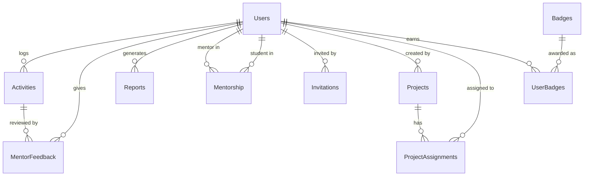

# Database Schema Reference

> **Source of truth:** This file mirrors the schema documentation from the main project repository.
> The canonical definition is in `server/prisma/schema.prisma`. See [Database](../database.md) for the full model documentation.

---

## Main Models

### 1. Users

| Field | Type | Constraint | Description |
|---|---|---|---|
| `id` | UUID | Primary Key | Unique identifier |
| `email` | String | Unique, Not Null | Login email |
| `passwordHash` | String | Nullable | Bcrypt-hashed password |
| `firstName` | String | Not Null | First name |
| `lastName` | String | Not Null | Last name |
| `emailConfirmed` | Boolean | Default: false | Email verification status |
| `role` | Enum | Not Null | `student`, `mentor`, `super_admin` |
| `isActive` | Boolean | Default: true | Account active status |
| `isFirstTimeLogin` | Boolean | Default: true | First-login flag |
| `invitedBy` | String | Nullable | ID of inviting user |
| `createdAt` | Timestamp | Default: now() | Creation time |
| `updatedAt` | Timestamp | Auto-updated | Last update time |

---

### 2. Activities

| Field | Type | Constraint | Description |
|---|---|---|---|
| `id` | UUID | Primary Key | Unique identifier |
| `studentId` | UUID | FK → Users.id | The student who logged this |
| `date` | DateTime | Not Null | When the activity occurred |
| `timeSpent` | Integer | Not Null | Duration in minutes |
| `notes` | String | Nullable | Additional notes |
| `createdAt` | Timestamp | Default: now() | Submission time |
| `updatedAt` | Timestamp | Auto-updated | Last update time |

---

### 3. MentorFeedback

| Field | Type | Constraint | Description |
|---|---|---|---|
| `id` | UUID | Primary Key | Unique identifier |
| `activityId` | UUID | FK → Activities.id | Activity being reviewed |
| `mentorId` | UUID | FK → Users.id | Reviewing mentor |
| `status` | Enum | Not Null | `approved`, `rejected`, `pending` |
| `feedbackNotes` | Text | Nullable | Mentor comments |
| `createdAt` | Timestamp | Default: now() | Feedback submission time |
| `updatedAt` | Timestamp | Auto-updated | Last update time |

---

### 4. Reports

| Field | Type | Constraint | Description |
|---|---|---|---|
| `id` | UUID | Primary Key | Unique identifier |
| `mentorId` | UUID | FK → Users.id | Report author |
| `reportData` | JSON | — | Report content/payload |
| `createdAt` | Timestamp | Default: now() | Creation time |

---

### 5. Mentorship

| Field | Type | Constraint | Description |
|---|---|---|---|
| `id` | UUID | Primary Key | Unique identifier |
| `mentorId` | UUID | FK → Users.id | The mentor |
| `studentId` | UUID | FK → Users.id | The student |

---

### 6. Invitations

| Field | Type | Constraint | Description |
|---|---|---|---|
| `id` | UUID | Primary Key | Unique identifier |
| `email` | String | Not Null | Invited email |
| `role` | Enum | Not Null | `student`, `mentor`, `super_admin` |
| `token` | String | Unique | Secure invitation token |
| `expiresAt` | DateTime | Not Null | Token expiry datetime |
| `accepted` | Boolean | Default: false | Whether invitation was used |
| `createdAt` | Timestamp | Default: now() | Creation time |

---

### 7. Projects

| Field | Type | Constraint | Description |
|---|---|---|---|
| `id` | UUID | Primary Key | Unique identifier |
| `name` | String | Not Null | Project name |
| `description` | String | Nullable | Short description |
| `domain` | Enum | Not Null | `software`, `film`, `training`, `research`, `other` |
| `createdBy` | UUID | FK → Users.id | Admin who created it |
| `createdAt` | Timestamp | Default: now() | Creation time |
| `updatedAt` | Timestamp | Auto-updated | Last update time |

---

### 8. ProjectAssignments

| Field | Type | Constraint | Description |
|---|---|---|---|
| `id` | UUID | Primary Key | Unique identifier |
| `projectId` | UUID | FK → Projects.id | The project |
| `studentId` | UUID | FK → Users.id | Assigned student |
| `assignedAt` | Timestamp | Default: now() | Assignment time |

---

### 9. Badges

| Field | Type | Constraint | Description |
|---|---|---|---|
| `id` | UUID | Primary Key | Unique identifier |
| `name` | String | Not Null | Badge name |
| `description` | String | Nullable | What the badge represents |
| `iconUrl` | String | Nullable | Badge icon image URL |
| `createdAt` | Timestamp | Default: now() | Creation time |

---

### 10. UserBadges

| Field | Type | Constraint | Description |
|---|---|---|---|
| `id` | UUID | Primary Key | Unique identifier |
| `userId` | UUID | FK → Users.id | User who earned it |
| `badgeId` | UUID | FK → Badges.id | The badge awarded |
| `awardedAt` | Timestamp | Default: now() | Award time |

---

## ER Diagram

---

For the complete and up-to-date schema, see `server/prisma/schema.prisma` in the main repository.
